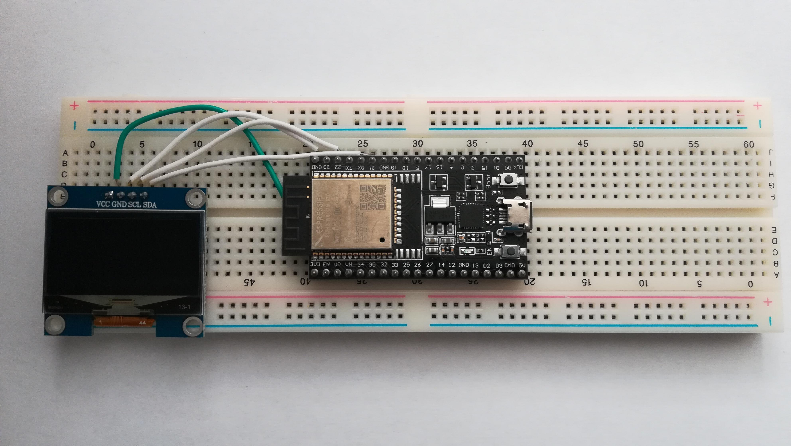
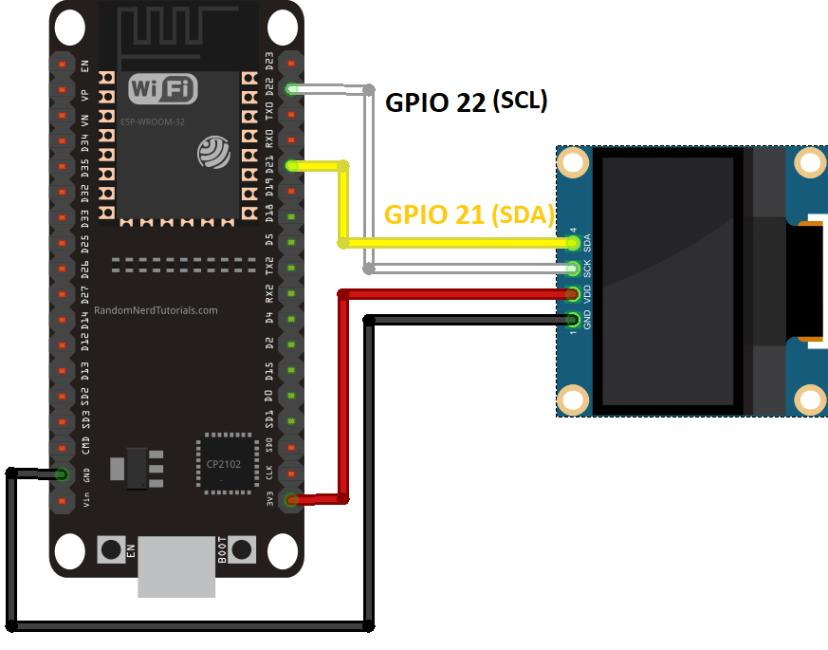
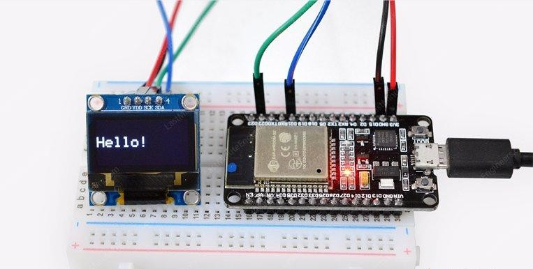

<!-- HEADER -->

<h1 align="center">🚀 Integration Solver using ESP32</h1>
<p align="center">
  Numerical Integration on Embedded Systems with OLED Output
</p>

<p align="center">
  
  
  
  
</p>

---

## 📌 Overview

This project implements a **numerical integration system** using the ESP32 microcontroller.
It computes **definite integrals** within a given range using efficient numerical methods and displays results on an OLED screen.

---

## 🎯 Key Highlights

* ⚡ Real-time computation on ESP32
* 🧠 Uses optimized numerical methods
* 📟 OLED display output
* 🔧 Memory-efficient implementation

---

## 🧮 Numerical Methods Used

### 🔹 Riemann Sum

* Uses rectangular approximation
* Lightweight computation
* Faster but less accurate

### 🔹 Trapezoidal Rule

* Uses trapezoidal approximation
* Better accuracy
* Balanced performance

---

## ⚠️ Constraints & Optimization

* ESP32 is a **32-bit microcontroller**
* Limited memory and floating-point precision

### ✅ Optimizations Implemented

* Efficient loop-based computation
* Reduced memory footprint
* Selected lightweight numerical techniques

---

## 🛠️ Hardware Components

* ESP32 Module
* OLED Display (SSD1306)
* Breadboard
* Jumper Wires
* USB Cable

---

## 💻 Software & Libraries

* Arduino IDE
* Adafruit SSD1306 Library
* Adafruit GFX Library
* Math Library

---

## 📷 Project Images

### 🔌 Circuit Diagram




### 🖥️ Output Display




---

## ⚙️ How It Works

1. User inputs function and limits
2. ESP32 processes using numerical method
3. Integration is calculated
4. Output displayed on OLED

---

## 📊 Example

**Input:**
Function: f(x) = x²
Range: 0 to 2

**Output:**
Integration ≈ 2.67

---

## 📁 Project Structure

```
Integration-Solver-ESP32/
│
├── matrix_solver.cpp
├── README.md
└── images/
```

---

## 👥 Team Members

* Subhajit Hazra
* Pratik Pritam Ghosh
* Jay Prakash
* Sarfaraz Ansari

---

## 👨‍🏫 Mentor

Dr. D.C. Sarkar, University of kalyani

---

## 🔮 Future Improvements

* 🌐 Web interface using ESP32 WiFi
* 📈 Improved precision algorithms
* 🔢 NxN matrix + integration support

---

## 📌 Author

**Subhajit Hazra**

---

<p align="center">⭐ If you like this project, give it a star!</p>
